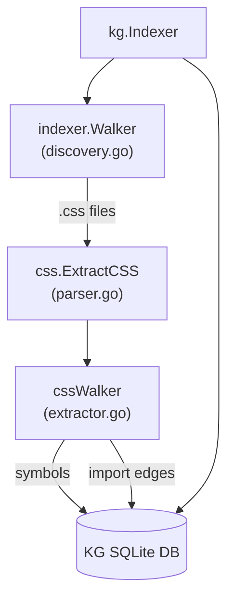

# System Design & Architecture

## Architecture Overview

The CSS indexer follows the same layered pattern used for HTML and JavaScript:

**Key components:**
- `internal/kg/indexer/css/parser.go` — language singleton + `ExtractCSS` entry point
- `internal/kg/indexer/css/extractor.go` — `cssWalker` struct; AST traversal and symbol/import extraction
- `internal/kg/indexer/discovery.go` — add `.css` to `langForFile` and default walker set
- `internal/kg/lang/` — (if this package exists) add `"css"` constant; otherwise rely on the string literal used consistently elsewhere

## Data Models

Reuses existing `kgdb.SymbolRow` and `kgdb.CallsiteRow` (no DB schema changes needed).

| Extracted entity          | `SymbolRow.Kind`  | FQN pattern                          |
|---------------------------|-------------------|--------------------------------------|
| `.foo` class selector     | `class`           | `<module>.foo`                       |
| `#bar` ID selector        | `id`              | `<module>#bar`                       |
| `@keyframes fade-in`      | `keyframes`       | `<module>@fade-in`                   |
| `--my-color` custom prop  | `variable`        | `<module>--my-color`                 |

Import edges: `@import "tokens.css"` → `ImportPaths = ["tokens.css"]` (no callsites for CSS).

## Component Breakdown

### `css/parser.go`
- Holds the `*ts.Language` singleton (protected by `sync.Once`), same pattern as `javascript/parser.go` and `html/parser.go`.
- `ExtractCSS(src, relPath, repoID, fileID)` creates parser, parses, delegates to walker, returns `CSSExtractResult`.

### `css/extractor.go`
- `cssWalker` struct with `src`, `repoID`, `fileID`, `fileModule`, `importSeen`, `symbols`, `imports`.
- `walkNode` dispatches on tree-sitter node kinds:
  - `rule_set` → walk into `selectors` → extract class/ID selectors
  - `at_rule` with name `keyframes` / `@keyframes` → extract animation name
  - `at_rule` with name `import` → extract path string
  - `declaration` with property starting `--` → extract custom property name
- No callsite extraction (CSS has none).

### `discovery.go` changes
- `langForFile`: add `case ".css": return "css"`.
- `NewWalker` default set: add `langMap["css"] = true`.

## Design Decisions

1. **Mirror existing pattern exactly** — keeps onboarding cost zero; any contributor familiar with `html/` understands `css/` immediately.
2. **No call-sites** — CSS has no function-call semantics; `CSSExtractResult.Callsites` is always empty but kept for interface consistency.
3. **Custom properties only at `:root` or top-level** — avoids indexing thousands of per-element overrides; scope to `declaration` nodes whose parent is a `rule_set` with `:root` selector or directly under `stylesheet`.
4. **Limit selector extraction to class and ID** — tag selectors (`div`, `h1`) are too noisy and carry no meaningful symbol identity.

## Non-Functional Requirements

- **Concurrency-safe**: each `ExtractCSS` call creates its own parser/tree (same as JS/HTML).
- **Performance**: single AST pass, no second traversal needed for CSS.
- **No new DB migrations**: reuses existing schema.
