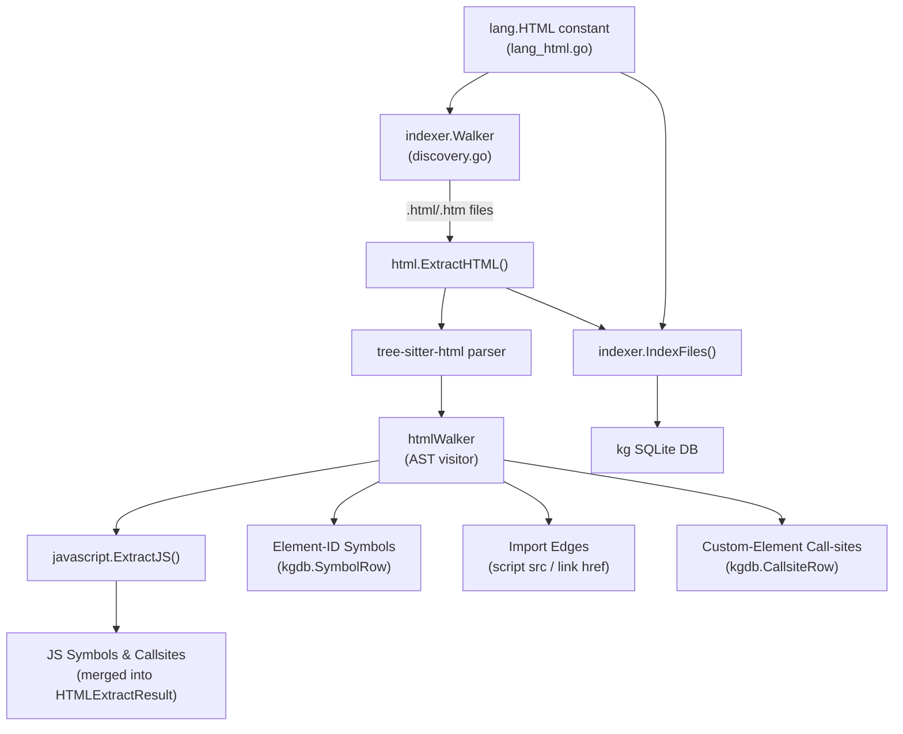

# System Design & Architecture

## Architecture Overview



## Data Models

### `HTMLExtractResult`
```go
type HTMLExtractResult struct {
    Symbols     []kgdb.SymbolRow    // element-ID symbols + JS symbols from inline scripts
    Callsites   []kgdb.CallsiteRow  // custom-element usages + JS callsites from inline scripts
    ImportPaths []string            // script src / link href values
    SrcPkgFQN   string             // file-level FQN (e.g. "pages/index")
}
```

### Symbol rows produced

| Kind        | FQN pattern                          | Example                  |
|-------------|--------------------------------------|--------------------------|
| `id`        | `reldir/basename#idValue`            | `pages/index#hero`       |
| (JS kinds)  | delegated to JS extractor            | `pages/index.myFunc`     |

### Call-site rows produced

| Kind            | Callee FQN pattern             | Example                      |
|-----------------|-------------------------------|------------------------------|
| custom-element  | `<tagName>`                   | `my-button`                  |
| (JS callsites)  | delegated to JS extractor     | `pages/index.fetch`          |

## Component Breakdown

### `internal/kg/indexer/html/parser.go`
- Singleton tree-sitter HTML language (same `sync.Once` pattern as JS).
- `ExtractHTML(src []byte, relPath string, repoID, fileID int64) HTMLExtractResult`

### `internal/kg/indexer/html/extractor.go`
- `htmlWalker` struct — visits AST nodes.
- Handles: `element` / `script_element` / `tag_name` / `attribute` / `attribute_value`.
- For `<script src="...">`: appends to `imports`.
- For `<link href="...">`: appends to `imports`.
- For element with `id="..."`: creates a `SymbolRow{Kind: "id", ...}`.
- For custom-element start tags (tag name contains `-`): creates a `CallsiteRow`.
- For `<script>` with no `src`: extracts text content, calls `javascript.ExtractJS`,
  merges results.

### `internal/kg/lang/lang_html.go`
- `HTML Lang` constant and `LangHTML` descriptor (extensions, resolver stub).

### `internal/kg/indexer/discovery.go` changes
- Add `.html` and `.htm` to `langForFile`.

### `internal/kg/indexer/indexer.go` changes
- Route `"html"` files to `html.ExtractHTML` (mirrors JS routing).

### `internal/kg/lang/resolve_html.go`
- No-op resolver that logs and returns nil.

## Design Decisions

1. **Delegate inline scripts to JS extractor** — avoids duplicating extraction logic; the
   JS extractor is already battle-tested and handles all JS AST patterns.
2. **FQN `reldir/basename#id`** — `#` is the conventional CSS/URL fragment separator for
   element IDs; makes FQNs self-descriptive and avoids collisions with JS symbol FQNs
   that use `.`.
3. **Custom elements only for call-sites** — standard HTML tags (`div`, `span`, etc.) are
   too generic to be meaningful graph edges; custom elements (containing `-`) are
   component references worth tracking.
4. **No-op resolver** — HTML has no established LSP for call-site resolution in this
   context; the no-op keeps the interface consistent without blocking the feature.

## Non-Functional Requirements

- **Thread-safety**: `ExtractHTML` must be safe for concurrent calls (same constraint as JS).
- **Performance**: tree-sitter parsing is O(n) in file size; no additional constraints.
- **No new CGo linkage**: tree-sitter bindings already use CGo; no new CGo is introduced.
