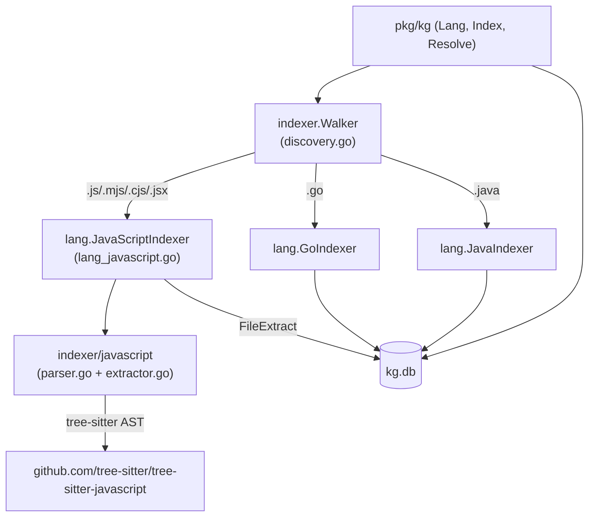

# System Design & Architecture

## Architecture Overview

The new JavaScript indexer plugs into the existing strategy-based language pipeline without
changing any shared infrastructure.

**New components only** — existing Go/Java paths are unchanged.

## Data Models

No new database tables. JS symbols and call-sites are stored in the same `symbols` and
`callsites` tables with `lang = "javascript"`.

| Symbol kind | JS construct |
|---|---|
| `function` | `function` declarations and `function` expressions assigned to `const`/`let`/`var` |
| `arrow_function` | arrow-function expressions assigned to `const`/`let`/`var` |
| `class` | `class` declarations and `class` expressions |
| `method` | methods inside `class` bodies |
| `variable` | top-level `const`/`let`/`var` (non-function) |

FQN scheme: `<reldir>/<basename>.<symbolName>` where `<basename>` is the file name without
extension (e.g. `src/utils/helpers.formatDate`). For nested symbols (methods):
`<fileModule>.<ClassName>.<methodName>`.

Call-sites: any `call_expression` whose function is an `identifier` or a
`member_expression` becomes a callsite row. Confidence = 0.5, provenance = "heuristic".

Import paths: `import … from "…"` and `require("…")` calls emit import-path strings for
future cross-file graph edges (stored via `kgdb.StoreImportRefs`).

## API Design

No new external CLI flags. The existing `--lang` flag already accepts arbitrary strings;
adding `"javascript"` (alias `"js"`) to `parseLangFlag` in `internal/command/kg.go` is
sufficient.

## Component Breakdown

| File | Purpose |
|---|---|
| `internal/kg/indexer/javascript/parser.go` | singleton tree-sitter Language + `ExtractJS()` entry point |
| `internal/kg/indexer/javascript/extractor.go` | AST walker that produces `JSExtractResult` |
| `internal/kg/lang/lang_javascript.go` | `JavaScriptIndexer` (implements `lang.Indexer`) |
| `internal/kg/lang/resolve_javascript.go` | no-op `JavaScriptResolver` (implements `lang.Resolver`) |
| `internal/kg/indexer/discovery.go` | add JS extensions to `langForFile`; add `"javascript"` default |
| `pkg/kg/types.go` | add `LangJavaScript Lang = "javascript"` |
| `pkg/kg/resolve.go` | accept `"javascript"` without error |
| `internal/command/kg.go` | map `"js"` alias → `"javascript"` in `parseLangFlag` |

## Design Decisions

| Decision | Rationale |
|---|---|
| Mirror Java indexer structure exactly | Minimal diff, consistent reviewer mental model |
| No-op resolver for JS | LSP-based JS resolver is a separate, larger effort |
| Include `.jsx` | JSX is syntactically valid JS for tree-sitter-javascript |
| Exclude `.ts`/`.tsx` | Needs separate grammar; reduces scope |
| FQN = `reldir/basename.symbol` | Consistent with Go's package-path prefix; avoids collisions |

## Non-Functional Requirements

- **Performance**: JS file parsing must be concurrency-safe (each `ExtractJS` call creates
  its own tree-sitter parser and tree, freed before return — same pattern as Java).
- **Correctness**: parse errors are non-fatal; file is stored with empty symbol set and a
  warning log.
