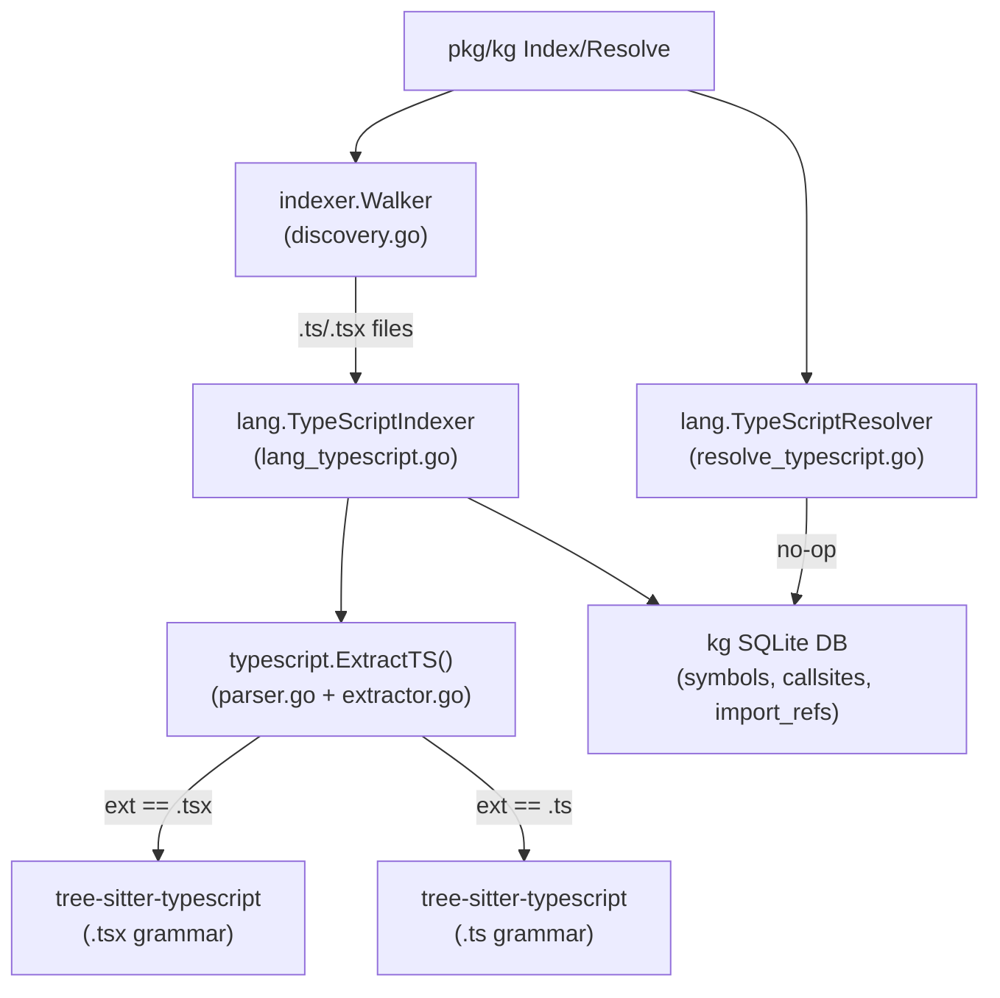

# System Design & Architecture

## Architecture Overview

The TypeScript indexer follows the exact layered architecture already established by the JavaScript
indexer. No new abstractions are introduced — only new language-specific implementations behind
existing interfaces.

**Technology stack**: Go + `github.com/tree-sitter/tree-sitter-typescript/bindings/go` (same
CGo-free, pre-compiled WASM approach as all other tree-sitter language bindings in this project).

## Data Models

No schema changes. TypeScript symbols are stored in the existing `symbols` and `callsites` tables
with `lang = "typescript"`. Import paths go into `import_refs`.

| Field       | Value for TypeScript                                 |
|-------------|------------------------------------------------------|
| `lang`      | `"typescript"`                                       |
| `kind`      | `function`, `arrow_function`, `class`, `method`, `interface`, `type_alias`, `enum`, `enum_member`, `variable` |
| `fqn`       | `<reldir>/<basename_no_ext>.<symbolName>` (same as JS) |
| `confidence`| `0.5` (heuristic)                                    |
| `provenance`| `"heuristic"`                                        |

## Component Breakdown

### `internal/kg/indexer/typescript/parser.go`
- Package-level singleton `*ts.Language` for each grammar (typescript, tsx), lazily initialized
  with `sync.Once`.
- `ExtractTS(src []byte, relPath string, repoID, fileID int64) TSExtractResult` — selects the
  correct grammar based on `filepath.Ext(relPath)`, creates a parser, parses, walks, returns.

### `internal/kg/indexer/typescript/extractor.go`
- `tsWalker` struct (mirrors `jsWalker`).
- `walkNode` dispatches on node kind — handles all JS node kinds **plus**:
  - `interface_declaration` → kind `"interface"`
  - `type_alias_declaration` → kind `"type_alias"`
  - `enum_declaration` → kind `"enum"` + walks enum body for `enum_assignment` → kind `"enum_member"`
  - `ambient_declaration` (e.g. `declare function`) → delegates to inner declaration node
- Signature building for interfaces: `interface <name>` (no params).
- Signature building for type aliases: `type <name>`.
- Signature building for enums: `enum <name>`.

### `internal/kg/lang/lang_typescript.go`
- `TypeScriptIndexer` implementing `Indexer` (identical structure to `JavaScriptIndexer`).
- Delegates to `tsindexer.ExtractTS`.

### `internal/kg/lang/resolve_typescript.go`
- `TypeScriptResolver` no-op implementing `Resolver` (identical to `JavaScriptResolver`).

### `internal/kg/indexer/discovery.go`
- `langForFile`: add `".ts", ".tsx"` → `"typescript"`.
- `NewWalker` default langs map: add `"typescript": true`.

### `pkg/kg/types.go`
- Add `LangTypeScript Lang = "typescript"`.

### `pkg/kg/index.go`
- Add `"typescript": &kglang.TypeScriptIndexer{}` to `langIndexers` map.

### `pkg/kg/resolve.go`
- Add `"typescript": &kglang.TypeScriptResolver{}` to `resolvers` map.
- Update error message to include `LangTypeScript`.

## Design Decisions

### Two grammars, one package
`tree-sitter-typescript` exposes two Go functions from `bindings/go`:
`LanguageTypescript()` and `LanguageTSX()`. The extractor uses file extension to pick the correct
one. This is the canonical approach recommended by the tree-sitter maintainers.

### No new interfaces or extension points
TypeScript adds no new edge types (no `extends_refs`, no `type_refs` for this release). The
`StoreRefs` implementation mirrors the JS one — only `import_refs` are stored.

### `ts` alias
The `ParseLangs` function in `internal/kg/lang/lang.go` lowercases input but does not alias. The
alias `ts` → `typescript` is handled at the `pkg/kg` boundary by the `langsToFlag` caller. We add
it to `pkg/kg/index.go`'s `langsToFlag`... actually, looking at the code, `Lang` values come
directly from the CLI as typed `Lang` constants. The CLI should define `LangTypeScript` and users
pass `--lang typescript`. No alias normalization is needed in this release (same as `javascript` has
no `js` alias at the package level). The requirement to support `ts` alias will be satisfied by
documenting `LangTypeScript = "typescript"` in the CLI help text.

## Non-Functional Requirements

- Thread-safe: `tsWalker` instances are created per-call; only the language singletons are shared,
  protected by `sync.Once`.
- No performance regression: same concurrency model as all other indexers.

